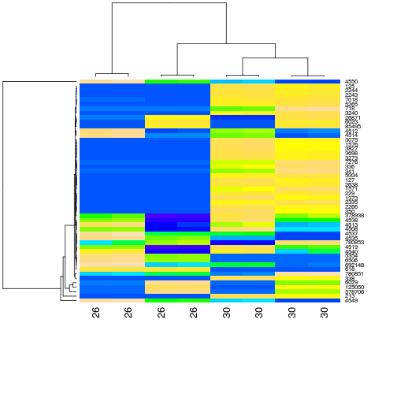
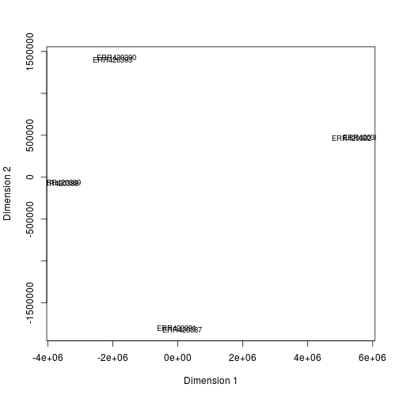
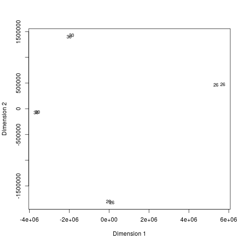
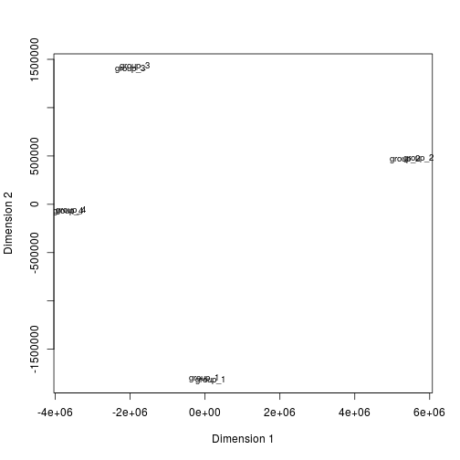

# RNAseq DE analysis with R - Solutions

This document provides solutions to the exercises given in the 'RNAseq DE analysis with R' course.

## Clustering


> ## Exercise: Heatmap  {.challenge}
> Produce a heatmap for the 50 most highly expressed genes and annotate the samples with with their age.
>
> * Subset the read counts object for the 50 most highly expressed genes
> * Annotate the samples in the subset with their age (check order with design!)
> * Plot a heatmap with this subset of data, scaling genes and ordering both genes and samples

Solution:


```r
# Subset the read counts object for the 30 most highly expressed genes
select = order(rowMeans(counts$counts), decreasing=TRUE)[1:50]
highexprgenes_counts <- counts$counts[select,]

# Annotate the samples in the subset with their age (check order with design!)
colnames(highexprgenes_counts)<- experiment_design.ord$age
head(highexprgenes_counts)
```

```
##              26      26      30      30      30      26       26      30
## 4550   12559197 7221252 3612091 3696466 5332585 7045283 12201302 5190887
## 4549    2635341 1542503  880852  900136 1256473 1506197  2564452 1226882
## 213         711     633 1554756 1591787 1992909     541      560 1939249
## 378706    87658 2085194 1200456 1212964   62432 2063356    86078   61130
## 6029      44288 1461296  723247  726382   18142 1449540    43866   17747
## 125050    80094  740715  588378  595398   54657  726225    78199   53896
```

```r
# Plot a heatmap with this subset of data, scaling genes and ordering both genes and samples
heatmap(highexprgenes_counts, col=topo.colors(50), margin=c(10,6))
```




## Principal Component Analysis

> ## Exercise: PCA {.challenge}
> Produce a PCA plot from the read counts of the 500 most highly expressed genes and change the labels until you can identify the reason for the split between samples from the same tissue. 
>
> * Get the read counts for the 500 most highly expressed genes
> * Transpose this matrix of read counts
> * Check the number of dimensions explaining the variability in the dataset
> * Run the PCA with an appropriate number of components
> * Annotate the samples with their age \& re-run the PCA \& plot the main components
> * Annotate the samples with other clinical data \& re-run the PCA \& plot the main components until you can separate the samples within each tissue group


Solution:

```r
# select data for the 1000 most highly expressed genes
select = order(rowMeans(counts$counts), decreasing=TRUE)[1:500]
highexprgenes_counts <- counts$counts[select,]

# transpose the data to have variables (genes) as columns
data_for_PCA <- t(highexprgenes_counts)

# Run the PCA with an appropriate number of components
mds <- cmdscale(dist(data_for_PCA))

# Plot the PCA
plot(mds[,1], -mds[,2], type="n", xlab="Dimension 1", ylab="Dimension 2", main="")
text(mds[,1], -mds[,2], rownames(mds), cex=0.8) 
```



```r
# Annotate the samples with their age & re-run the PCA & plot the main components
rownames(mds) <- experiment_design.ord$age
plot(mds[,1], -mds[,2], type="n", xlab="Dimension 1", ylab="Dimension 2", main="")
text(mds[,1], -mds[,2], rownames(mds), cex=0.8) 
```



```r
# Annotate the samples with other clinical data & re-run the PCA & plot the main components until you can separate the samples within each tissue group
rownames(mds)<- experiment_design.ord$technical_replicate_group
plot(mds[,1], -mds[,2], type="n", xlab="Dimension 1", ylab="Dimension 2", main="")
text(mds[,1], -mds[,2], rownames(mds), cex=0.8) 
```




## Differential Expression

> ## Exercise: Limma {.challenge}
> Get the number of DE genes between technical group 1 and technical group 2 (all Brain samples) with adj pvalue<0.01.
>
> * Create a new design matrix for limma with the technical replicate groups
> * Re-normalise the read counts with 'voom' function with new design matrix
> * Fit a linear model on these normalised data
> * Make the contrast matrix corresponding to the new set of parameters
> * Fit the contrast matrix to the linear model
> * Compute moderated t-statistics of differential expression 
> * Get the output table for the 10 most significant DE genes for this comparison

Solution:


```r
library(limma)

# Create a new design matrix for limma with the technical replicate groups
techgroup<-factor(experiment_design.ord$technical_replicate_group)
design <- model.matrix(~0+techgroup)
colnames(design)<- gsub("techgroup","",colnames(design))
design
```

```
##   group_1 group_2 group_3 group_4
## 1       0       1       0       0
## 2       1       0       0       0
## 3       0       0       0       1
## 4       0       0       0       1
## 5       0       0       1       0
## 6       1       0       0       0
## 7       0       1       0       0
## 8       0       0       1       0
## attr(,"assign")
## [1] 1 1 1 1
## attr(,"contrasts")
## attr(,"contrasts")$techgroup
## [1] "contr.treatment"
```

```r
# Re-normalise the read counts with 'voom' function with new design matrix
y <- voom(mycounts,design,lib.size=colSums(mycounts)*nf)
counts.voom <- y$E

# Fit a linear model on these normalised data
fit <- lmFit(y,design)

# Make the contrast matrix corresponding to the new set of parameters
cont.matrix <- makeContrasts(group_2-group_1,levels=design)
cont.matrix 
```

```
##          Contrasts
## Levels    group_2 - group_1
##   group_1                -1
##   group_2                 1
##   group_3                 0
##   group_4                 0
```

```r
# Fit the contrast matrix to the linear model
fit <- contrasts.fit(fit, cont.matrix)

# Compute moderated t-statistics of differential expression 
fit <- eBayes(fit)
options(digits=3)

# Get the output table for the 10 most significant DE genes for this comparison
dim(topTable(fit,coef="group_2 - group_1",p.val=0.01,n=Inf))
```

```
## [1] 9652    6
```

```r
topTable(fit,coef="group_2 - group_1",p.val=0.01)
```

```
##         logFC AveExpr     t  P.Value adj.P.Val     B
## 125050 -3.598   13.36 -1219 6.95e-58  1.04e-53 123.0
## 378706 -4.964   14.07  -842 4.15e-54  3.12e-50 114.4
## 6029   -5.432   13.07  -500 8.61e-49  4.31e-45 102.0
## 4514    0.761   12.20   271 1.44e-42  5.42e-39  86.5
## 26871  -2.795   10.87  -187 8.96e-39  2.69e-35  78.7
## 6023   -4.752   10.00  -168 1.16e-37  2.90e-34  76.5
## 6043   -2.923    8.73  -164 2.02e-37  4.34e-34  75.9
## 5354    0.576    5.73   158 4.82e-37  9.05e-34  74.3
## 692148  0.733   10.39   146 3.15e-36  5.26e-33  72.6
## 652965 -2.864    7.83  -137 1.36e-35  2.04e-32  71.6
```


## Gene Ontology

> ## Exercise: GOstats {.challenge}
> Identify the GO terms in the Molecular Function domain that are over-represented (pvalue<0.01) in your list of DE genes.
>
> * Get your list of DE genes (Entrez Gene IDs)
> * Set the new parameters for the hypergeometric test
> * Run the test and adjust the pvalues in the output object
> * Identify the significant GO terms at pvalue 0.01

Solution:


```r
library(GOstats)
```

```
## Loading required package: Biobase
```

```
## Loading required package: BiocGenerics
```

```
## Loading required package: methods
```

```
## Loading required package: parallel
```

```
## 
## Attaching package: 'BiocGenerics'
```

```
## The following objects are masked from 'package:parallel':
## 
##     clusterApply, clusterApplyLB, clusterCall, clusterEvalQ,
##     clusterExport, clusterMap, parApply, parCapply, parLapply,
##     parLapplyLB, parRapply, parSapply, parSapplyLB
```

```
## The following object is masked from 'package:limma':
## 
##     plotMA
```

```
## The following objects are masked from 'package:stats':
## 
##     IQR, mad, xtabs
```

```
## The following objects are masked from 'package:base':
## 
##     anyDuplicated, append, as.data.frame, cbind, colnames,
##     do.call, duplicated, eval, evalq, Filter, Find, get, grep,
##     grepl, intersect, is.unsorted, lapply, lengths, Map, mapply,
##     match, mget, order, paste, pmax, pmax.int, pmin, pmin.int,
##     Position, rank, rbind, Reduce, rownames, sapply, setdiff,
##     sort, table, tapply, union, unique, unsplit
```

```
## Welcome to Bioconductor
## 
##     Vignettes contain introductory material; view with
##     'browseVignettes()'. To cite Bioconductor, see
##     'citation("Biobase")', and for packages 'citation("pkgname")'.
```

```
## Loading required package: Category
```

```
## Loading required package: stats4
```

```
## Loading required package: AnnotationDbi
```

```
## Loading required package: IRanges
```

```
## Loading required package: S4Vectors
```

```
## 
## Attaching package: 'S4Vectors'
```

```
## The following objects are masked from 'package:base':
## 
##     colMeans, colSums, expand.grid, rowMeans, rowSums
```

```
## Loading required package: Matrix
```

```
## 
## Attaching package: 'Matrix'
```

```
## The following object is masked from 'package:S4Vectors':
## 
##     expand
```

```
## Loading required package: graph
```

```
## 
```

```
## 
## Attaching package: 'GOstats'
```

```
## The following object is masked from 'package:AnnotationDbi':
## 
##     makeGOGraph
```

```r
# Get your list of DE genes (Entrez Gene IDs)
entrezgeneids <- as.character(rownames(limma.res.pval.FC))
universeids <- rownames(mycounts)

# Set the new parameters for the hypergeometric test
params <- new("GOHyperGParams",annotation="org.Hs.eg",geneIds=entrezgeneids,universeGeneIds=universeids,ontology="MF",pvalueCutoff=0.01,testDirection="over")
```

```
## Loading required package: org.Hs.eg.db
```

```
## 
```

```
## Warning in makeValidParams(.Object): removing geneIds not in
## universeGeneIds
```

```r
# Run the test and adjust the pvalues in the output object
hg <- hyperGTest(params)
hg.pv <- pvalues(hg)
hg.pv.fdr <- p.adjust(hg.pv,'fdr')

# Identify the significant GO terms at pvalue 0.01
sigGO.ID <- names(hg.pv.fdr[hg.pv.fdr < hgCutoff])
df <- summary(hg)
GOterms.sig <- df[df[,1] %in% sigGO.ID,"Term"]

length(GOterms.sig )
```

```
## [1] 433
```

```r
head(GOterms.sig)
```

```
## [1] "transmembrane receptor activity"          
## [2] "signal transducer activity"               
## [3] "signaling receptor activity"              
## [4] "transmembrane signaling receptor activity"
## [5] "receptor activity"                        
## [6] "molecular transducer activity"
```


## R environment


```r
sessionInfo()
```

```
## R version 3.3.1 (2016-06-21)
## Platform: x86_64-pc-linux-gnu (64-bit)
## Running under: Ubuntu 14.04.4 LTS
## 
## locale:
##  [1] LC_CTYPE=en_AU.UTF-8       LC_NUMERIC=C              
##  [3] LC_TIME=en_AU.UTF-8        LC_COLLATE=en_AU.UTF-8    
##  [5] LC_MONETARY=en_AU.UTF-8    LC_MESSAGES=en_AU.UTF-8   
##  [7] LC_PAPER=en_AU.UTF-8       LC_NAME=C                 
##  [9] LC_ADDRESS=C               LC_TELEPHONE=C            
## [11] LC_MEASUREMENT=en_AU.UTF-8 LC_IDENTIFICATION=C       
## 
## attached base packages:
## [1] stats4    parallel  methods   stats     graphics  grDevices utils    
## [8] datasets  base     
## 
## other attached packages:
##  [1] GO.db_3.3.0          org.Hs.eg.db_3.3.0   GOstats_2.38.1      
##  [4] graph_1.50.0         Category_2.38.0      Matrix_1.2-6        
##  [7] AnnotationDbi_1.34.4 IRanges_2.6.1        S4Vectors_0.10.2    
## [10] Biobase_2.32.0       BiocGenerics_0.18.0  limma_3.28.17       
## 
## loaded via a namespace (and not attached):
##  [1] knitr_1.13             magrittr_1.5           splines_3.3.1         
##  [4] xtable_1.8-2           lattice_0.20-33        stringr_1.0.0         
##  [7] tools_3.3.1            grid_3.3.1             AnnotationForge_1.14.2
## [10] DBI_0.4-1              genefilter_1.54.2      survival_2.39-5       
## [13] RBGL_1.48.1            GSEABase_1.34.0        formatR_1.4           
## [16] RSQLite_1.0.0          evaluate_0.9           stringi_1.1.1         
## [19] XML_3.98-1.4           annotate_1.50.0
```
